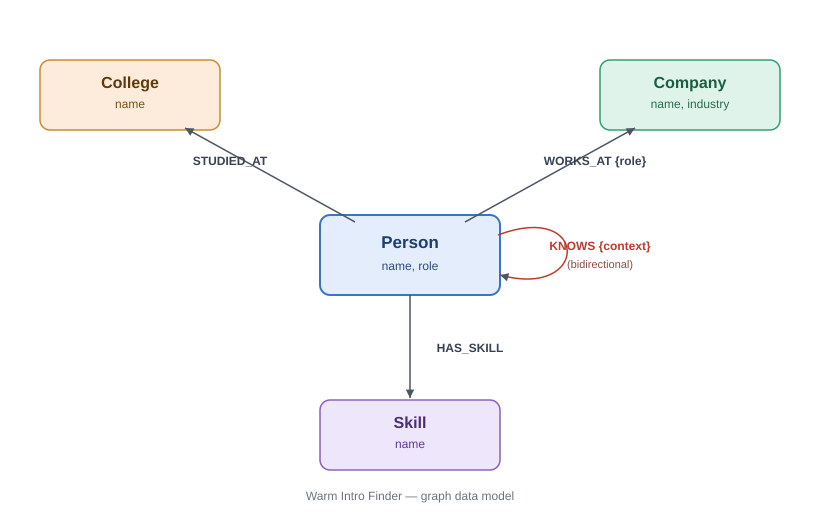

# Warm Intro Finder — Alumni Referral Path Finder

A small graph-backed web app that answers a question every job-seeker actually has:
**"Who do I know who can get me a warm intro at [Company]?"**

Built on **CognoDB** (Bolt/openCypher, Neo4j driver-compatible), Node.js/Express, and vanilla JS.

## Demo

- **Live app:** _[add hosted URL here after deploying]_
- **Screen recording:** _[add a 1–2 min walkthrough link here — Find Path → View on graph → Insights]_

## Why a graph database?

Referral networks are made of *relationships*, not rows. The core question — "what's the shortest
chain of people connecting me to someone at Company X?" — is a variable-length path / shortest-path
problem. In a relational database this means self-joining a `connections` table N times (one join
per hop), with the number of joins unknown in advance and blowing up combinatorially as the network
grows. In Cypher it's a single `shortestPath()` pattern match, regardless of how many hops it takes.

The second query — "find people from my college, who share ≥1 skill with me, and work at Company X" —
is a natural traversal across three different relationship types (`STUDIED_AT`, `HAS_SKILL`, `WORKS_AT`)
converging on one node. In SQL this is three joins plus a `GROUP BY`/`HAVING` for the skill-overlap
count; in Cypher it reads like the sentence describing it.

Two more places this shows up, added after the first pass:

- **Top connectors leaderboard** — ranking people by degree centrality (how many others they know)
  is a first-class graph metric. In SQL it's a self-join on the connections table plus
  `COUNT(DISTINCT ...)`, and it gets uglier the moment you want it joined against unrelated attributes
  like current employer.
- **Mutual connections** — "who do A and B both know, do they share skills, did they go to the same
  college, do they already know each other directly" is four different relationship types converging
  on a *pair* of nodes instead of one. Each becomes its own multi-way join with `NOT EXISTS` guards in
  SQL; in Cypher each is a short, independent pattern match.

## A bug I found and fixed

The first version of `getGraphSnapshot()` (used to render the live network view) selected
`elementId(n)` as the node id. `elementId()` is a **Neo4j-proprietary function** introduced in Neo4j 5
— it isn't part of the openCypher standard CognoDB implements, so the query failed and the graph never
rendered (silently, since the frontend just showed an empty canvas). The fix builds a stable id from
each node's label + business key (`name`) instead, using only standard openCypher (`labels()`,
`coalesce()`, `type()`) — portable to any openCypher-compliant engine, not just Neo4j-family databases.
See the comment above `getGraphSnapshot()` in `backend/queries/graphQueries.js` for the full note.

## Data model



```
(Person)-[:STUDIED_AT]->(College)
(Person)-[:WORKS_AT {role}]->(Company)
(Person)-[:HAS_SKILL]->(Skill)
(Person)-[:KNOWS {context}]->(Person)
```

- **Person**: name, role
- **College**: name
- **Company**: name, industry
- **Skill**: name

## Setup

1. **Create a CognoDB instance**
   - Sign up at https://console.cognodb.com/signup (free, no card required)
   - Create a free (c0) instance, pick a region
   - Copy the `bolt+s://...` URI and the generated password for user `cognodb` immediately — it's shown once

2. **Configure environment**
   ```bash
   cp .env.example .env
   # fill in COGNODB_URI and COGNODB_PASSWORD
   ```

3. **Install & seed** (run from the project root — `backend/` and `frontend/` sit alongside each other)
   ```bash
   npm install
   npm run seed
   ```

4. **Run**
   ```bash
   npm start
   # open http://localhost:3000
   ```

## Deployment

This is a single Node/Express process that serves both the API and the static frontend, and it
already reads `PORT` from the environment — so it deploys as-is to any Node host, no build step.

1. Push this repo to GitHub (`.env` is gitignored — never commit real credentials).
2. On the host, create a Node web service pointing at this repo:
   - **Build command:** `npm install`
   - **Start command:** `npm start`
3. Set the three environment variables from `.env.example` in the host's dashboard:
   `COGNODB_URI`, `COGNODB_USER`, `COGNODB_PASSWORD` (same values as your local `.env`).
4. Deploy, then run `npm run seed` once against the *same* CognoDB instance (locally, pointed at
   the same `.env`, is easiest) so the live app has data.
5. Paste the resulting URL into the **Demo** section at the top of this README.

## Main queries

**Shortest warm-intro path** (`/api/path`) — multi-hop traversal:
```cypher
MATCH (start:Person {name: $from}), (target:Company {name: $company})
MATCH path = shortestPath((start)-[:KNOWS*..6]-(end:Person))
WHERE (end)-[:WORKS_AT]->(target)
RETURN [n IN nodes(path) | n.name] AS chain, end.name AS contact
ORDER BY length(path) ASC LIMIT 1
```

**Best connector recommendation** (`/api/recommend`) — the SQL-awkward one:
```cypher
MATCH (me:Person {name: $from})-[:STUDIED_AT]->(col:College)<-[:STUDIED_AT]-(cand:Person)
MATCH (cand)-[:WORKS_AT]->(target:Company {name: $company})
MATCH (me)-[:HAS_SKILL]->(sharedSkill:Skill)<-[:HAS_SKILL]-(cand)
WITH cand, col, collect(DISTINCT sharedSkill.name) AS sharedSkills
WHERE size(sharedSkills) >= 1
RETURN cand.name AS name, col.name AS college, sharedSkills
```

**Top connectors** (`/api/leaderboard`) — degree centrality:
```cypher
MATCH (p:Person)-[:KNOWS]->(other:Person)
WITH p, count(DISTINCT other) AS connections
OPTIONAL MATCH (p)-[:WORKS_AT]->(c:Company)
RETURN p.name AS name, connections, c.name AS company
ORDER BY connections DESC, name ASC
LIMIT $limit
```

**Mutual connections** (`/api/mutual`) — four relationship types converging on a pair of nodes:
```cypher
MATCH (a:Person {name: $personA})-[:KNOWS]->(mutual:Person)<-[:KNOWS]-(b:Person {name: $personB})
WHERE mutual.name <> $personA AND mutual.name <> $personB
RETURN DISTINCT mutual.name AS name ORDER BY name
```
(run alongside similarly-shaped queries for shared skills, shared college, and a direct-connection check)

All queries are parameterized via the official `neo4j-driver` — no string concatenation.

## Features

- **Find Path** — shortest warm-intro path from you to anyone at a target company, with a
  "View this path on the graph →" link that jumps to the live graph and highlights exactly that
  chain of nodes and edges, dimming everything else
- **Recommended connectors** — best-fit intro candidates via the college + shared-skill query
- **Explore Network** — a live, physics-based visualization (vis-network) of every node and
  relationship currently in CognoDB, color-coded by label, with a stats strip (node counts by
  label, total connections, average connections per person) and a "Show full graph" reset
- **Insights** — a top-connectors leaderboard ranked by degree centrality, and a mutual-connections
  finder that compares any two people's shared acquaintances, shared skills, and shared college
- **Search by skill** — find everyone in the network with a given skill
- **Add Person / Add Connection** — write new nodes and relationships into the graph from the UI,
  demonstrating the app isn't read-only (the cached graph snapshot is invalidated on write so the
  live view picks up new nodes immediately)

## Project structure

```
backend/
  config.js              # env-driven configuration
  db.js                   # CognoDB driver + connection verification
  queries/
    graphQueries.js        # every Cypher query, parameterized, one place
  routes/
    api.js                  # Express routes -> query layer, no inline Cypher
  server.js               # wires config + routes together, serves frontend/
  seed.js                 # loads sample data
frontend/
  index.html              # page shell
  css/style.css            # design system (constellation / night-sky theme)
  js/app.js                # tab logic, API calls, vis-network graph rendering
```

Routes never contain Cypher directly — they call into `backend/queries/graphQueries.js`, which is
the only place that talks to the driver. This keeps query logic testable and reviewable independent
of HTTP concerns, and keeps frontend and backend cleanly separated.

## Design

The UI leans into what the app actually models: a network of people. The theme is a night sky —
people, companies, colleges, and skills as different-colored stars, with a warm intro path rendered
as a glowing amber constellation chain. Fraunces (serif display) pairs with Inter (body) for contrast
between warmth and precision.

## Error handling

All API routes wrap DB calls in try/catch and return `503` with a clear message if CognoDB is
unreachable. The frontend shows a connection-status banner and per-section error/empty/loading states.

## Seed data

`npm run seed` clears the database and loads 20 people, 8 companies, 6 colleges, 12 skills, and 24
`KNOWS` relationships (48 directed edges, since each friendship is stored both ways). The graph is
built with a few deliberate hubs (people who know 3+ others) and overlapping clusters so the
leaderboard, mutual-connections finder, and recommended-connectors query all have real signal to
show off, not just a single trivial example.

## Screenshots

_Replace each placeholder below with an actual screenshot before submitting._

**Find Path** — a shortest-path result, chain of names, and the recommended-connectors panel
``

**Explore Network** — the live graph with the stats strip visible
``

**Path highlighted on the graph** — result of clicking "View this path on the graph →"
``

**Insights** — the top-connectors leaderboard and a mutual-connections result
``

**Add Person** — the add-person / add-connection form
``
